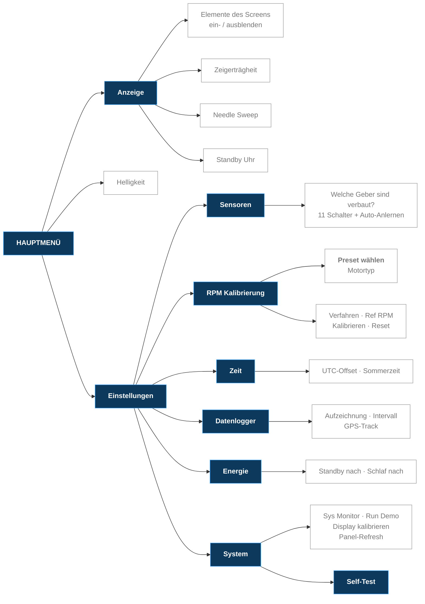

# Das Bedien-Menü

Übersicht über alle Menüpunkte der Firmware **v1.1 (Beta)**.

Bedient wird alles über den **Dreh-Encoder**.

---

## Bedienung

| Eingabe | Wirkung |
|---|---|
| **Drehen** | Zeile wechseln |
| **Kurz drücken** | Auswählen / Untermenü öffnen / Schalter umlegen |
| **Lang drücken** | Menü sofort komplett schließen |

Bei Punkten mit mehreren Werten (z. B. Helligkeit) drückst du **einmal** –
die Zeile wird **grün**. Jetzt änderst du mit dem Drehen den Wert. Noch einmal
drücken übernimmt ihn.

Passt eine Liste nicht komplett aufs Display, erscheint rechts eine
**Bildlaufleiste**. Einfach weiterdrehen, die Liste schiebt sich mit.

Die unterste Zeile ist immer **„Zurueck"**. Im Hauptmenü schließt sie das Menü.

---

## Der Menübaum

**Einstellungen** enthält bewusst nur Untermenüs. Alles, was ein Wert oder ein
Schalter ist, sitzt eine Ebene tiefer.

---

## Hauptmenü

| Punkt | Bedeutung |
|---|---|
| **Anzeige** | Was auf dem Display zu sehen ist |
| **Helligkeit** | 5 – 100 % (Stufen: 5, 10, 20, 30, 40, 60, 80, 100) |
| **Einstellungen** | Alles Weitere |
| **Zurueck** | Menü schließen |

---

## Anzeige

Hier blendest du einzelne Elemente des Screens ein und aus, auf dem du gerade
bist. **Die Liste ändert sich also je nach Screen** – auf Screen 3 stehen mehr
Punkte als auf Screen 1.

| Screen | Elemente, die du ein-/ausschalten kannst |
|---|---|
| **Screen 1** | Drehzahl Zeiger · Temperatur · Tank · Uhrzeit |
| **Screen 2** | Drehzahl Zeiger · Geschwindigkeit · Ladedruck · Temperatur · Tank · Uhrzeit |
| **Screen 3** | Drehzahl Zeiger · Drehzahl Bogen · Speed · Ladedruck · Ladeluft Temp · Tageskilometerzähler · Uhrzeit |

Darunter stehen – auf jedem Screen gleich – diese drei Punkte:

| Punkt | Bedeutung |
|---|---|
| **Zeigerträgheit** | Wie schnell die Zeiger einem Wert folgen: `Traege` · `Normal` · `Direkt` · `Snappy` |
| **Needle Sweep** | Der Begrüßungs-Zeigerlauf beim Einschalten |
| **Standby Uhr** | Springt sofort zum Uhren-Screen |

> **Geschwindigkeit / Speed** ist ein Mehrfachwert: `Rad km/h`, `GPS km/h`,
> `Beide` oder `Aus` – du wählst also die Quelle der Tempo-Anzeige.

---

## Einstellungen → Sensoren

Hier sagst du der Firmware, **welche Geber bei dir tatsächlich verbaut sind**.
Ein ausgeschalteter Geber wird nicht ausgewertet und erzeugt keine Warnung.

Tank · Kühlwasser · Ladedruck · Ansaug vor LLK · Ansaug nach LLK · Öldruck ·
Öldr.-Sch. 0,3 · Öldr.-Sch. 0,9 · Öltemperatur · Außentemperatur ·
Radsensor (Hall)

| Punkt | Bedeutung |
|---|---|
| **Auto-Anlernen** | Die Firmware prüft selbst, welche Geber angeschlossen sind, und setzt die Schalter passend |

> Diese Liste ist länger als das Display – hier scrollt das Menü.

---

## Einstellungen → RPM Kalibrierung

Damit die Drehzahl stimmt, muss die Firmware wissen, wie viele Impulse dein
Motor pro Umdrehung liefert.

| Punkt | Bedeutung |
|---|---|
| **Preset wählen** | Motortyp vorgeben: `Diesel JX/AAZ`, `Benz 4-Zyl`, `Benz 5-Zyl`, `Benz 6-Zyl`, `Custom / ECU` oder `Manuell` (frei einstellbar) |
| **Verfahren** | Messverfahren der Drehzahl |
| **Ref RPM** | Referenz-Drehzahl fürs Kalibrieren (Leerlauf, z. B. 840) |
| **Kalibrieren** | Motor auf die Referenz-Drehzahl bringen, dann diesen Punkt drücken |
| **Reset** | Kalibrierung verwerfen |

---

## Einstellungen → Zeit

| Punkt | Bedeutung |
|---|---|
| **UTC-Offset** | Zeitzone (Deutschland Winter: `+1`) |
| **Sommerzeit** | Eine Stunde dazu |

Die Uhrzeit selbst kommt vom GPS.

---

## Einstellungen → Datenlogger

| Punkt | Bedeutung |
|---|---|
| **Aufzeichnung** | Messwerte auf die SD-Karte schreiben |
| **Intervall** | Wie oft aufgezeichnet wird (in 10-Sekunden-Schritten) |
| **GPS-Track** | Zusätzlich die gefahrene Strecke aufzeichnen |

---

## Einstellungen → Energie

| Punkt | Bedeutung |
|---|---|
| **Standby nach** | Nach dieser Zeit ohne Bedienung springt das Gerät auf die Standby-Uhr (30 s bis 30 min, oder `Aus`) |
| **Schlaf nach** | Nach dieser Zeit geht das Display aus (30 s bis 60 min, oder `Aus`) |

---

## Einstellungen → System

Werkzeuge für Diagnose und Service – im Alltag brauchst du die nicht.

| Punkt | Bedeutung |
|---|---|
| **Sys Monitor** | Blendet CPU- und Speicher-Auslastung ein |
| **Run Demo** | Simulierte Messwerte, um die Anzeigen ohne laufenden Motor zu prüfen |
| **Self-Test** | Siehe unten |
| **Display kalibrieren** | Bildlage des Displays einstellen |
| **Panel-Refresh** | Treibt **Nachleuchten** (Image Sticking) aus dem Display, wenn ein Standbild sich eingebrannt hat |

### System → Self-Test

| Punkt | Bedeutung |
|---|---|
| **Bei Start** | Selbsttest bei jedem Einschalten ausführen |
| **Manueller Start** | Selbsttest jetzt sofort ausführen |

---

## Wo finde ich die Version?

Im **Boot-Screen** und **unten im Menü** – dort steht immer die laufende
Firmware-Version.
